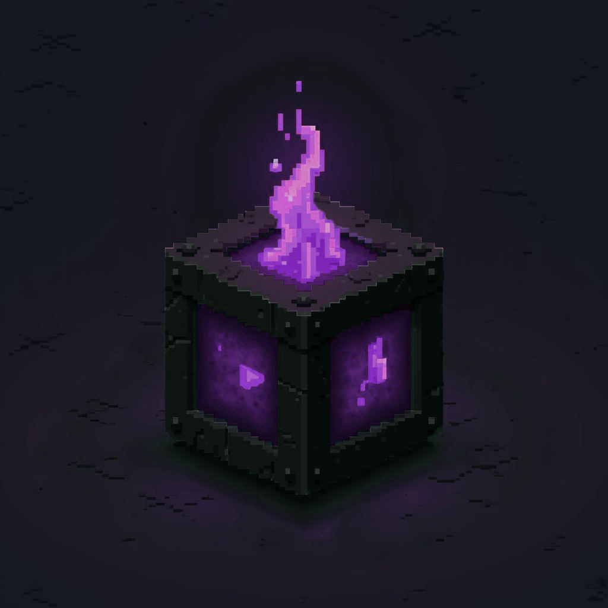

    
    <h1 align="center">CursedComponents</h1>

## About the Mod
**CursedComponents** is a Minecraft mod that introduces new blocks and items, many of which are inspired by elements from mods that worked with past versions of Minecraft.

> **Note:** CursedComponents is currently in active development. The mod is not yet ready for a full release, so expect updates and potential changes.

## Supported Versions
CursedComponents is currently being developed for Minecraft 1.21.x. Support for other versions may be added in the future.

## License
This mod's source code is licensed under the [GNU General Public License v3.0](../LICENSE), with the exception of bundled APIs from other mods, which retain their respective licenses.
