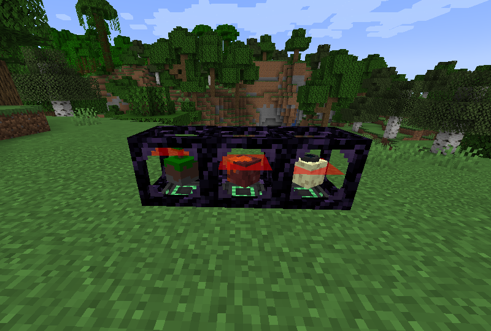
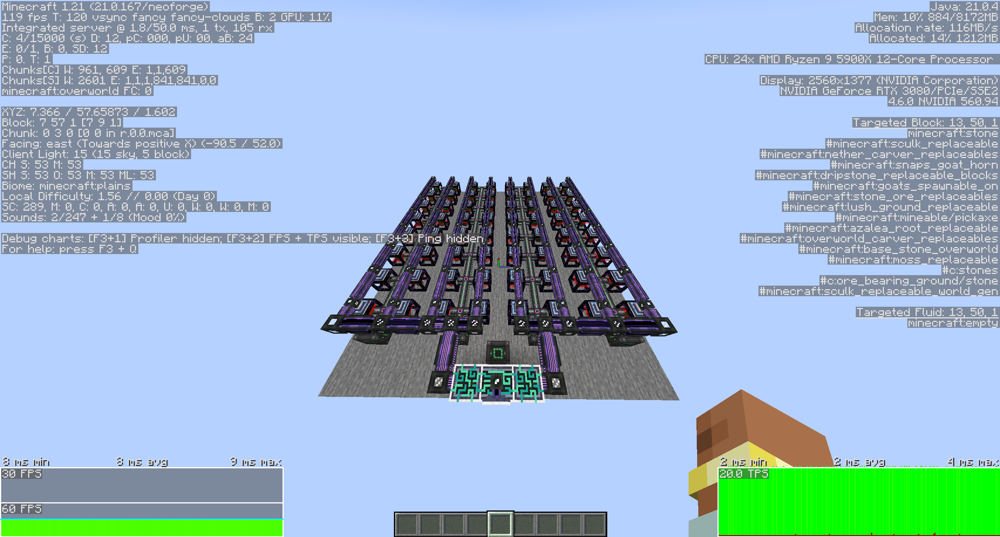

    
    <h1 align="center">CursedComponents</h1>

## About the Mod

**CursedComponents** is a Minecraft mod that introduces new blocks and items, many of which are inspired by elements
from mods that worked with past versions of Minecraft.

> **Note:** CursedComponents is currently in active development. The mod is not yet ready for a full release, so expect
> updates and potential changes.

## Blocks

### Dimensional Quarry

    

Dimensional Quarry is a machine that mine blocks in a parallel dimension, replacing the world eater ruining your world.
The parallel dimension is an exact replica of the corresponding dimensions, thus mod compatability is assured. The
Dimensional Quarry requires a Netherite Pickaxe and a Mini Chunk in order to operate. The choice
of [Mini Chunk](#mini-chunk)
determines which dimension the Dimensional Quarry mines from. In its base form it uses 40'000 FE/t mining one block
every 15 ticks. Upgrading the Dimensional Quarry is as easy as enchanting the Netherite Pickaxe with efficiency,
unbreaking and/or fortune/silk touch. Efficiency V increases the mining speed up to one block per tick, unbreaking III
reduces the energy usage down to 25'000 FE/t while fortune and silk touch work like normal. In case you do not want your
Dimensional Quarry to mine a certain block, add a [Dimensional Quarry Blacklist](#dimensional-quarry-blacklist) item.

The Dimensional Quarry is lag friendly, occasional lag spikes (once ~20 minutes at full speed) due to chunk generation.

    
    <h4 align="center">64 Dimensional Quarries running at full speed using fortune III</h4>

### Mini Chunk

Three Mini Chunk blocks are added; one for the overworld, one for the nether and one for the end. These are used to
select which dimension the [Dimensional Quarry](#dimensional-quarry) operates in, or simply as decoration pieces.

## Items

### Dimensional Quarry Blacklist

A simple item used in the [Dimensional Quarry](#dimensional-quarry) in order to blacklist certain items to be mined. It
supports up to 5 blacklisted items. The [Dimensional Quarry](#dimensional-quarry) will still mine at the same speed as
if the blacklist was not present but the blocks will not be added to the
internal [Dimensional Quarry](#dimensional-quarry) inventory.

### Crafting Ingredients

* ``Warden Infusion`` New drop from killing the Warden with a drop rate of 1-3
* ``Warden Infused Diamond``

## Supported Versions

CursedComponents is currently being developed for Minecraft 1.21.x. Support for other versions may be added in the
future.

## License

This mod's source code is licensed under the [GNU General Public License v3.0](../LICENSE), with the exception of
bundled APIs from other mods, which retain their respective licenses.
